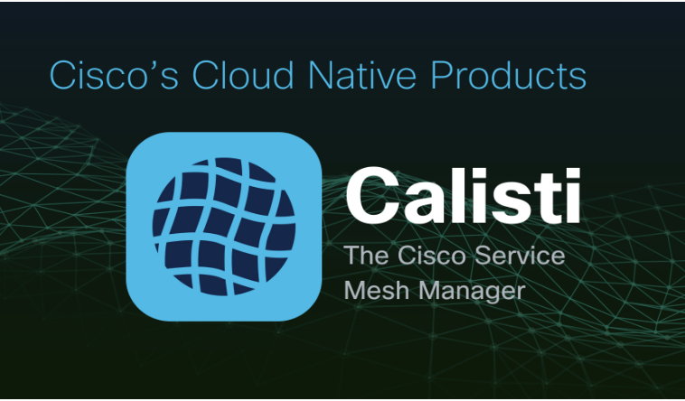
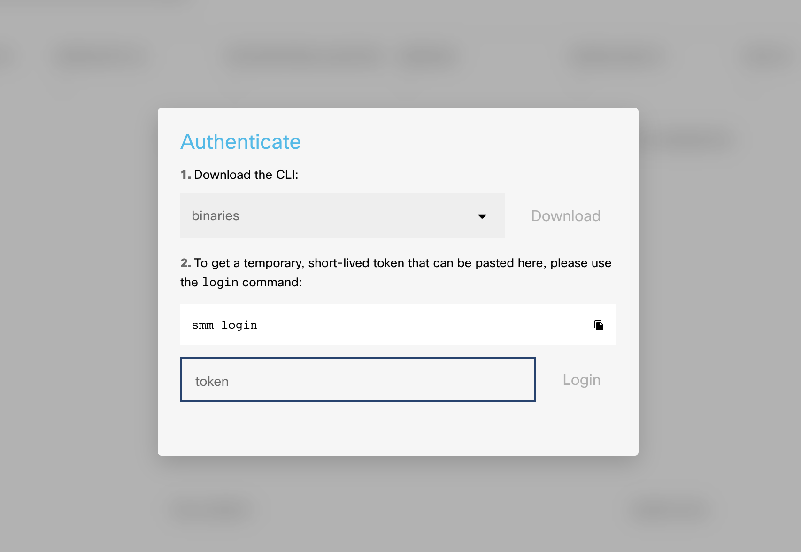
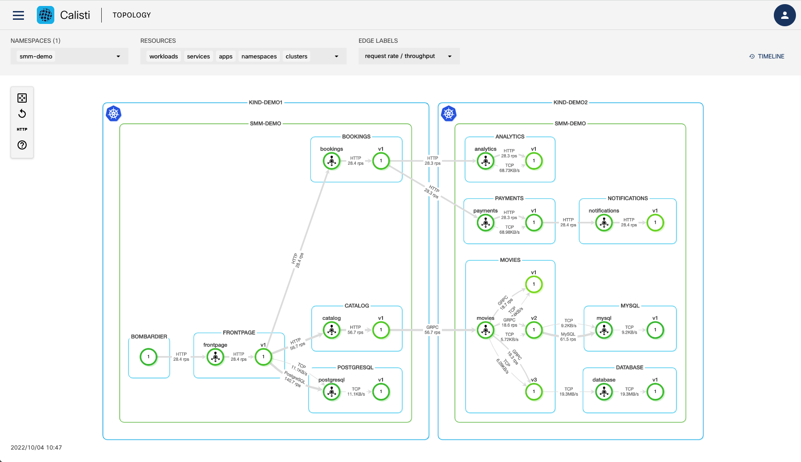

Welcome to the DEVWKS-2235 Hands-on Lab - Calisti: Deploy, manage and troubleshoot your service mesh.



# Getting started

A service mesh provides many benefits to Cloud Native applications, including observability, security, and load-balancing. However, mesh architectures present operators with several inherent challenges including lifecycle management, fragmented observability, and the complexity of enabling advanced use-cases, such as canary deployments, customized traffic management and circuit breakers.

Calisti is a multi and hybrid-cloud enabled service mesh platform for constructing modern applications. Built on Kubernetes, and our Istio operator, Calisti enables flexibility, portability and consistency across on-prem data centres and cloud environments. Calisti operationalizes the service mesh to bring deep observability, convenient management, and policy-based security to modern container & virtual machine-based applications.

Calisti includes Prometheus to ensure faster troubleshooting and recovery. It supports distributed tracing via Jaeger which is installed automatically by default when installing Calisti. 

Upon completion of this lab, you will be able to: 

•	Observe, monitor and manage traffic across various microservices

•	Debug and troubleshoot issues in your service

### Kubernetes Checks

Two KinD (Kubernetes in Docker) clusters have already been deployed for you. To check the status of the Kubernetes cluster, do the following:

Verify the clusters exist.  Expected output should show the 'demo1' and 'demo2' clusters.

```bash
kind get clusters
```
Get the list of nodes in the cluster. We should have 3.

```bash
kind get nodes --name demo1
```

Check the status of the pods running in the cluster.  All pods should be in "Running" state.

```bash
kubectl get pods -A
```

Check the Calisti SMM cluster status:

```bash
smm istio cluster status -c ~/.kube/demo1.kconf
```

You can also have an overview of the cluster using k9s - a terminal based UI to interact with your Kubernetes cluster.

```bash
k9s
```


(press Ctrl+c to exit)

## Calisti dashboard

Calisti provides a dashboard interface that can be used to diagnose any issues with the underlying deployment.

In order to be able to access the Calisti dashboard outside of the lab container we need to enable a reverse-proxy. NOTE: This step is only needed in this lab. In a 'normal' Calisti deployment, the process to access the dashboard is different and documented in the product docs. 
```bash
$HOME/lab/config/smm/proxy.sh
```

For authenticating to the dashboard we will need an authentication token which is generated using the smm login command

```bash
smm login
```

Press enter when prompted:
```
Press enter to continue.
```

Please copy the generated token and paste in the dedicated field when opening the [dashboard](http://location.hostname:8080) in your browser. Note that the token has a limited validity in time, so if you encounter any errors please re-generate & retry.



## The Calisti Dashboard - Topology View

Click the three horizontal menu lines at the top-left of the screen > Select "TOPOLOGY".

In the "NAMESPACES" list, select "smm-demo" checkbox if it is not already checked.

The Calisti dashboard shows the demo application that is deployed across two Kubernetes clusters.





