# Traffic management

## Traffic tap

The traffic tap feature of Calisti enables you to monitor live access logs of the Istio sidecar proxies. Each sidecar proxy outputs access information for the individual HTTP requests or HTTP/gRPC streams.

The access logs contain information about the: reporter proxy, source and destination workloads, request, response, as well as the timings.

### Traffic tap using the CLI

To watch the access logs for an individual namespace, workload/pod, use the "smm tap" command. Be sure to have some live traffic generated using any of the previous methods for this to work.

For smm-demo namespace

```bash
smm tap ns/smm-demo
```

Press Ctrl+C in the terminal to stop. The output should be similar to

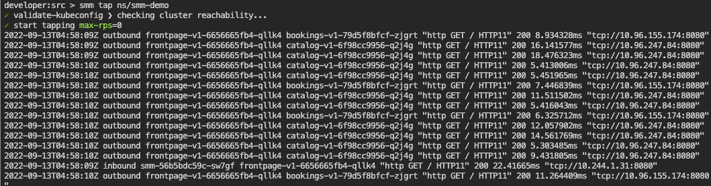

It is also possible to filter on workload

```bash
smm tap --ns smm-demo workload/bookings-v1
```

### Traffic tap using the UI

Select the menu at the top-left of the screen and select "TRAFFIC TAP" then select "smm-demo" in the "REPORTING SOURCE" list. Select "START STREAMING".

After a few seconds, select "PAUSE STREAMING".

The functionality is also available in the UI, including setting the different filters.

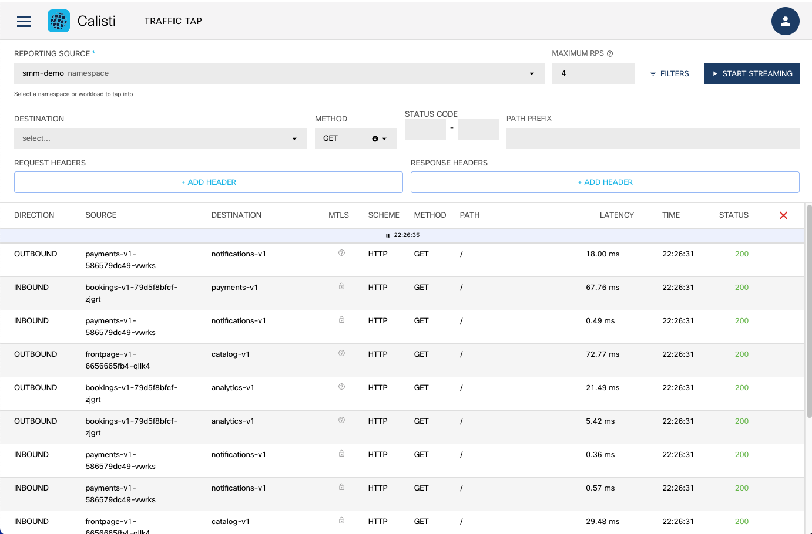

Select any row of a trace to see more information about that trace.

### Distributed Tracing

Calisti also provides distributed tracing - the process of tracking individual requests throughout their whole call stack in the system.

With distributed tracing in place it is possible to visualize full call stacks, to see which service called which service, how long each call took and how much were the network latencies between them. It is possible to tell where a request failed or which service took too much time to respond.
To collect and visualize this information, Istio comes with tools like Jaeger which is installed automatically by default when installing Calisti.

The demo application uses golang services which are configured to propagate the necessary tracing headers.

Once load is sent to the application, traces can be perceived right away.
Jaeger is exposed through an ingress gateway and the links are present on the UI (both on the graph and list view). 

Select the menu item at the top-left of the screen and select "TOPOLOGY". Select the "bookings" service then select the "Traces" item on the right-hand side of the screen (in the "OVERVIEW" tab).

In the Jaeger UI, select one of the rows of traces and click around the various spans of the trace to look at the details of the service and spans.


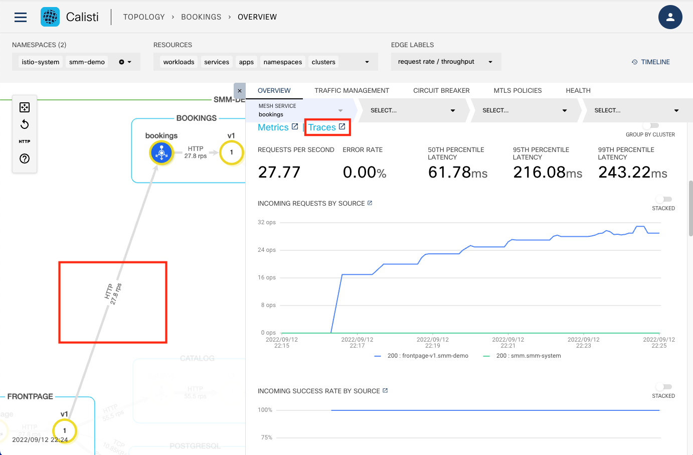

In the Jaeger UI you can see the whole call stack in the microservices architecture. You can see when exactly the root request was started and how much each request took. 

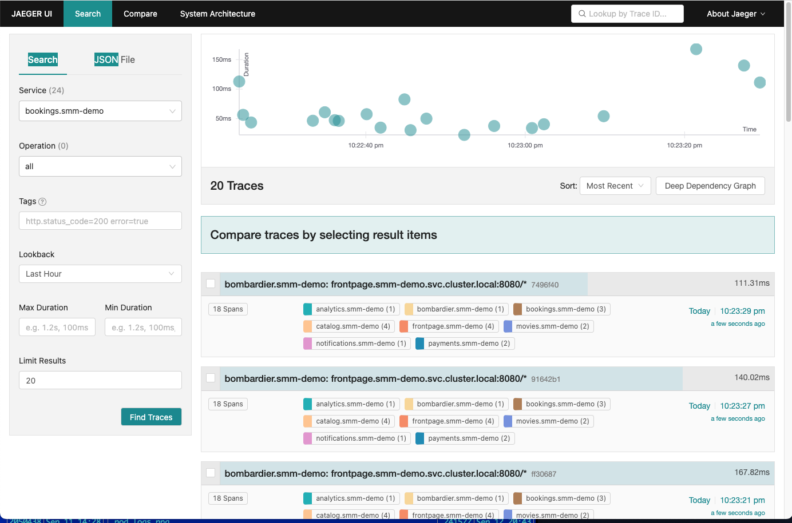


## Circuit breaking

Circuit Breaking is a pattern for creating resilient microservices applications. In microservices architecture, services are deployed across multiple nodes or clusters and have different response times or failure rate. Downstream clients need to be protected from excessive slowness of upstream services. Upstream services, in turn, must be protected from being overloaded by a backlog of requests.

A circuit breaker can have three states:

**Closed**: requests succeed or fail until the number of failures reach a predetermined threshold, with no interference from the breaker. When the threshold is reached, the circuit breaker opens.

**Open**: the circuit breaker trips the requests, which means that it returns an error without attempting to execute the call

**Half open**: the failing service is given time to recover from its broken behavior. If requests continue to fail in this state, then the circuit breaker is opened again and keeps tripping requests. Otherwise, if the requests succeed in the half open state, then the circuit breaker will close and the service will be allowed to handle requests again.

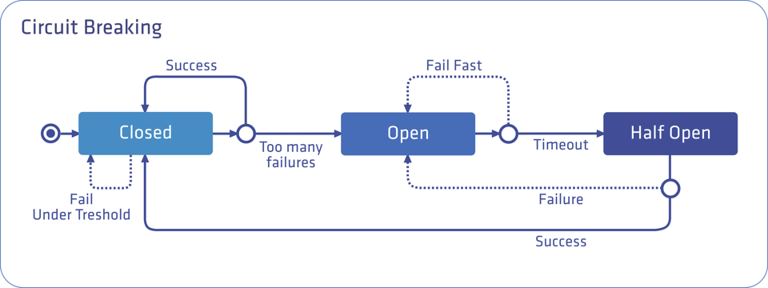

Calisti is using Istio’s - and therefore Envoy’s - circuit breaking feature under the hood.

Let's configure a circuit breaker for a service. In the "TOPOLOGY" view, select the "analytics" service, select the "CIRCUIT BREAKER" tab and then "Configure".

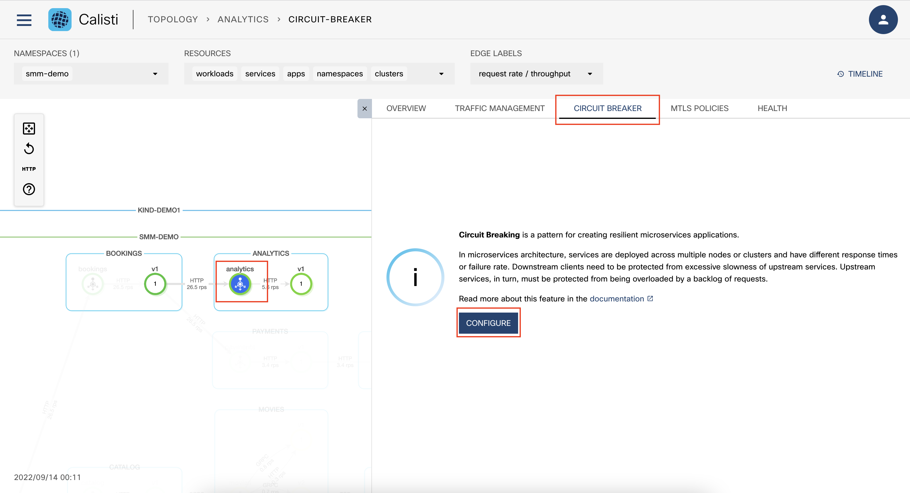

In order to be able to see immediate results of the Circuit Breaker activation, configure it with the with the following values:
- TCP settings
  - MAX CONNECTIONS: 1
  - CONNECTION TIMEOUT: 1
- HTTP settings
  - MAX PENDING HTTP REQUESTS: 1
  - MAX HTTP REQUESTS: 1
  - MAX REQUESTS PER CONNECTION: 1
  - MAX RETRIES: 1
- Outlier Detection settings
  - CONSECUTIVE ERRORS: 1
  - INTERVAL: 10
  - VASE EJECTION TIME: 10
  - MAX EJECTION PERCENTAGE: 1

Select "CONFIGURE"

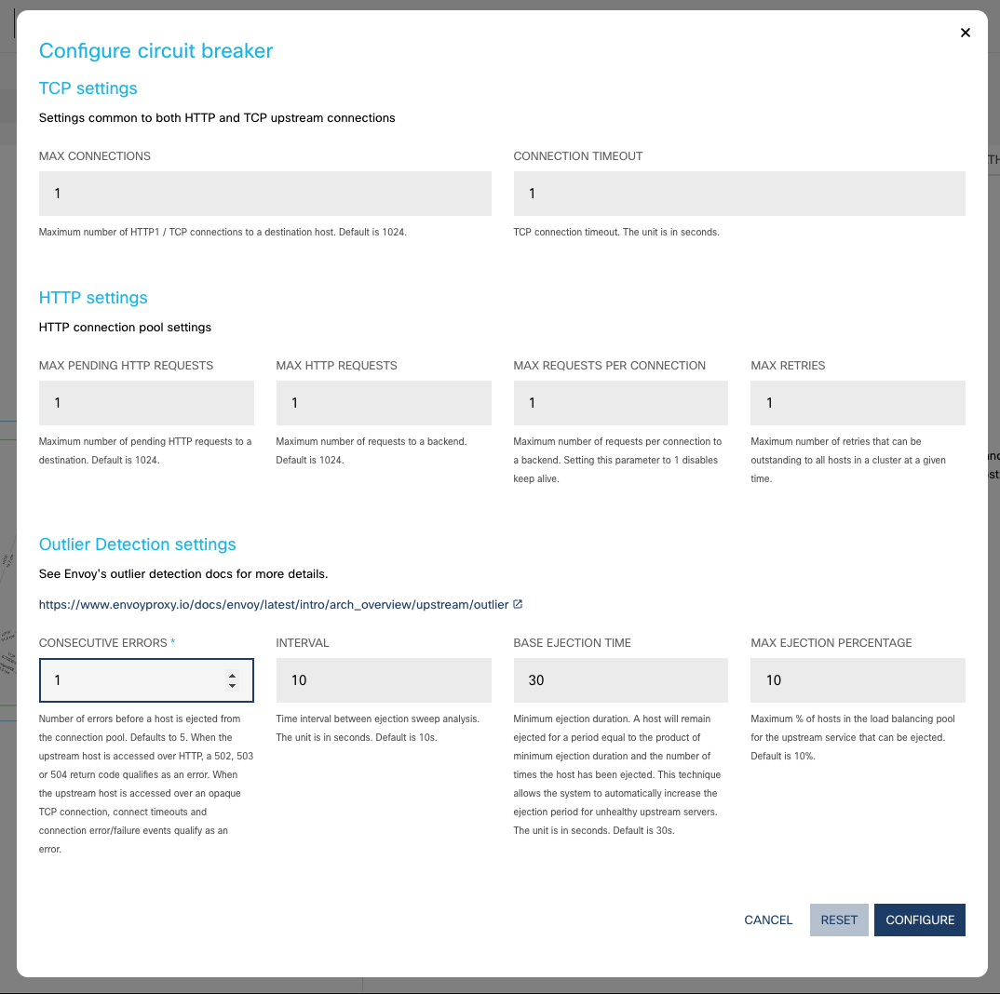

Generate some additional load on the analytics service.

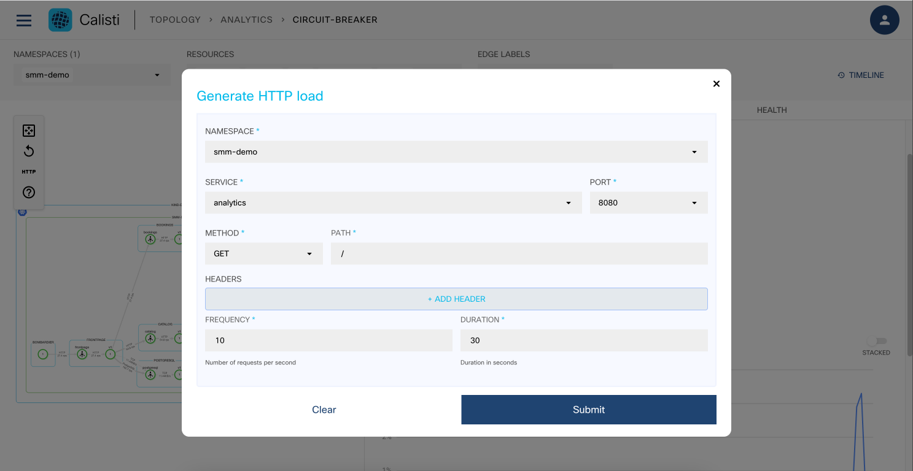

When traffic begins to flow the circuit breaker starts to trip requests. In the Calisti UI, you can see two live Grafana dashboards which specifically show the circuit breaker trips and help you learn more about the errors involved.

The first dashboard details the percentage of total requests that were tripped by the circuit breaker. When there are no circuit breaker errors, and your service works as expected, this graph shows 0%. Otherwise, it shows the percentage of the requests that were tripped by the circuit breaker.

The second dashboard provides a breakdown of the trips caused by the circuit breaker by source. If no circuit breaker trips occurred, there are no spikes in this graph. Otherwise, it shows which service caused the circuit breaker to trip, when, and how many times. Malicious clients can be tracked by checking this graph.

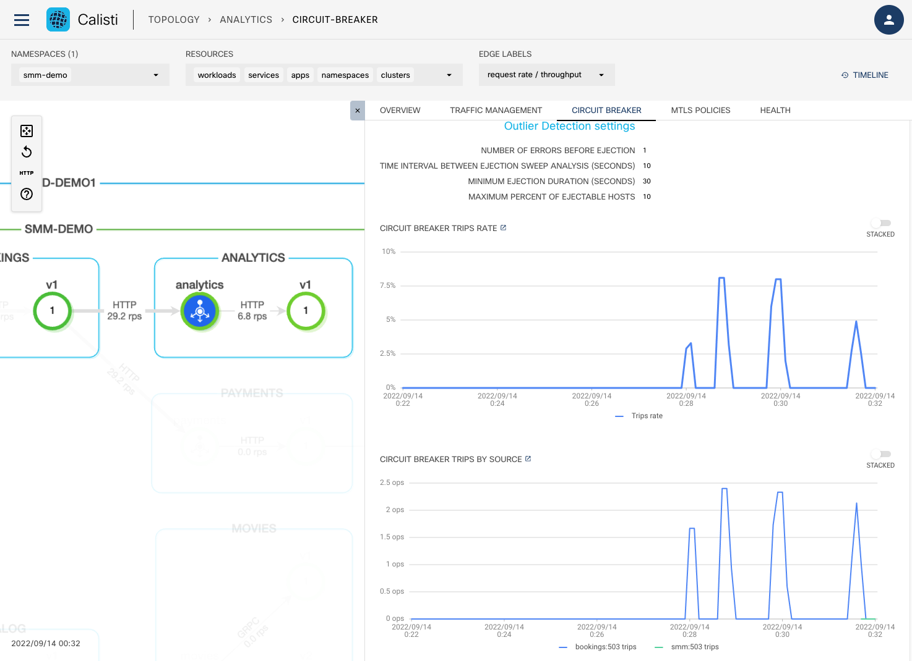

To remove circuit breaking select the Delete icon in the top of the "CIRCUIT BREAKER" entry.

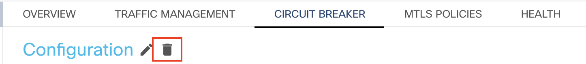


## Fault injection

Fault injection is a system testing method which involves the deliberate introduction of network faults and errors into a system. It can be used to identify design or configuration weaknesses, and to ensure that the system can handle faults and recover from error conditions.

With Calisti, you can inject failures at the application layer to test the resiliency of the services. You can configure faults to be injected into requests that match specific conditions to simulate service failures and higher latency between services. There are two types of failures:

**Delay** adds a time delay before forwarding the requests, emulating various failures such as network issues, an overloaded upstream service, and so on.

**Abort** aborts the HTTP request attempts and returns error codes to a downstream service, giving the impression that the upstream service is faulty.

Calisti uses Istio’s (Envoy) fault injection feature under the hood.

Select the "bookings" service in the "TOPOLOGY" view and "CREATE NEW".

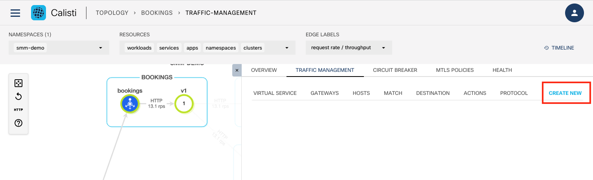

Set the Following values
- PORT NUMBER: 8080
- FAULT INJECTION:
  - DELAY PERCENTAGE: 50
  - ABORT PERCENTAGE: 40
  - FIXED DELAY: 3s
  - ABORT HTTP STATUS CODE: 503

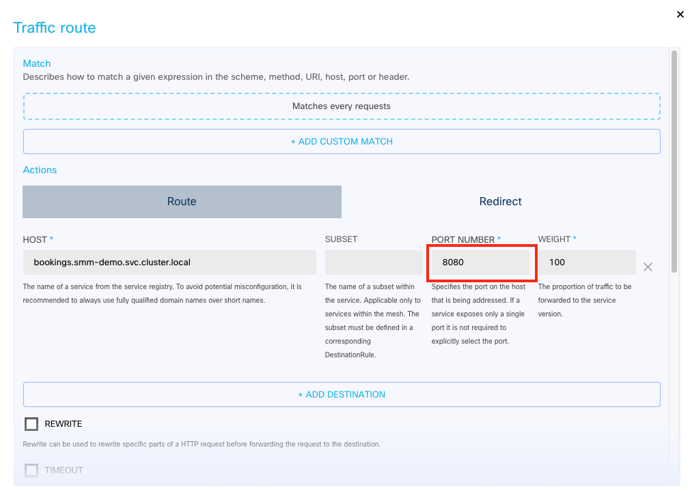
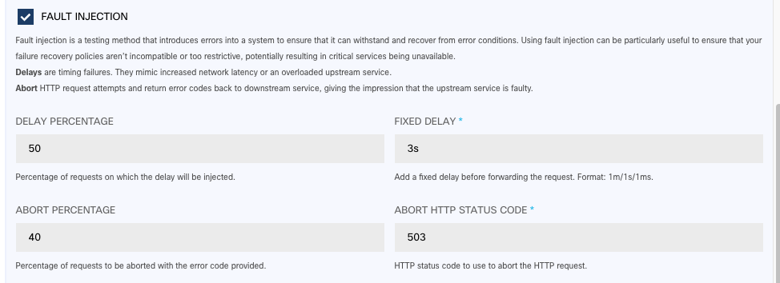

Select "Apply". Under the "OVERVIEW" tab, you can see the ERROR RATE increasing. Select the "HEALTH" tab. You can see that 503 HTTP response code graph climbing. Also, you can see an increasing number of errors under the two ERRORs tables.

Finally, notice that the BOOKINGS "v1" pod will change color over time. Eventually dependent services will begin to be impacted by the errors (FRONTPAGE-v1).

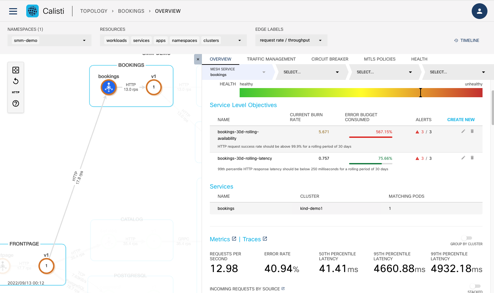

To remove the Fault Injection, select the "TRAFFIC MANAGEMENT" tab and click on the trash can icon to the far right of the fault policy and then confirm the route deletion by selecting "Delete".

## Traffic Steering/Splitting (Canaries, Blue/Green)

Application service meshes support the use of Traffic Steering, AKA: Traffic Splitting. This functionality provides a way to have multiple versions of a service and then 'steer' traffic to each version of that service by a percentage of traffic. This is an awesome way of testing out brand new code or new capablities using live traffic.

In the "TOPOLOGY" view, notice that under the "movies" service that there are a v1, v2 and v3 workloads. In this excercise you will steer traffic to only the v3 service.

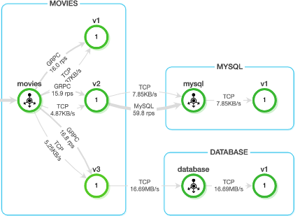

Select the "movies" service, then "TRAFFIC MANAGEMENT". You can see a pre-defined traffic management rule. You will notice that the defind traffic splitting ration is 33% for each version of the movies service.


Select the pencil icon on the far right of the existing traffic management rule. 

Set the Following values:
- Click the X on the first row to delete the v1 subset
- Click the X on the second row to delete the v2 subset
- SUBSET v3 - WEIGHT: 100

Select "Apply"

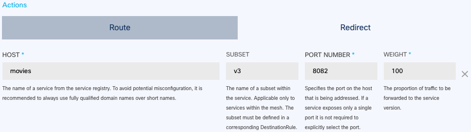

Generate traffic against the "movies" service.

Select the "v3" workload and under the "OVERVIEW" tab, you will see an increase in the "INCOMING REQUEST BY SOURCE" metric.


