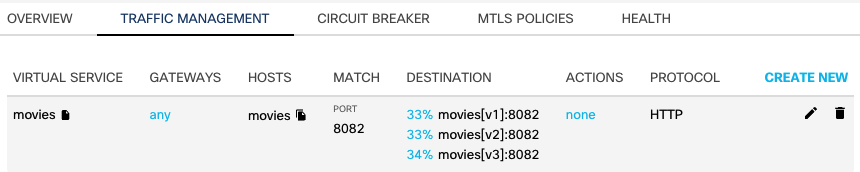

# Traffic management

## Traffic tap

The traffic tap feature of Calisti enables you to monitor live access logs of the Istio sidecar proxies. Each sidecar proxy outputs access information for the individual HTTP requests or HTTP/gRPC streams.

The access logs contain information about the reporter proxy, source and destination workloads, request, response, as well as the timings.

### Traffic tap using the UI

Select the menu at the top-left of the screen and select "TRAFFIC TAP" then select "smm-demo" in the "REPORTING SOURCE" list. Select "START STREAMING".

After a few seconds, select "PAUSE STREAMING".

The functionality is also available in the CLI, including setting the different filters (check the Calisti documentation).

Select any row of a trace to see more information about that trace.

## Fault injection

Fault injection is a system testing method which involves the deliberate introduction of network faults and errors into a system. It can be used to identify design or configuration weaknesses, and to ensure that the system can handle faults and recover from error conditions.

With Calisti, you can inject failures at the application layer to test the resiliency of the services. You can configure faults to be injected into requests that match specific conditions to simulate service failures and higher latency between services. There are two types of failures:

**Delay** - Adds a time delay before forwarding the requests, emulating various failures such as network issues, an overloaded upstream service, and so on.

**Abort** - Aborts the HTTP request attempts and returns error codes to a downstream service, giving the impression that the upstream service is faulty.

Calisti uses Istio’s (Envoy) fault injection feature under the hood.

Select the "bookings" service in the "TOPOLOGY" view, seelect "TRAFFIC MANAGEMENT" and "CREATE NEW".

Set the Following values
- PORT NUMBER: 8080
- FAULT INJECTION:
  - DELAY PERCENTAGE: 50
  - ABORT PERCENTAGE: 40
  - FIXED DELAY: 3s
  - ABORT HTTP STATUS CODE: 503

Select "Apply". Under the "OVERVIEW" tab, you can see the ERROR RATE increasing. Select the "HEALTH" tab. You can see that 503 HTTP response code graph climbing. Also, you can see an increasing number of errors under the two ERRORs tables.

Finally, notice that the BOOKINGS "v1" pod will change color over time. Eventually dependent services will begin to be impacted by the errors (FRONTPAGE-v1).

To remove the Fault Injection, select the "TRAFFIC MANAGEMENT" tab and click on the trash can icon to the far right of the fault policy and then confirm the route deletion by selecting "Delete".

## Traffic Steering/Splitting (Canaries, Blue/Green)

Application service meshes support the use of Traffic Steering, AKA: Traffic Splitting. This functionality provides a way to have multiple versions of a service and then 'steer' traffic to each version of that service by a percentage of traffic. This is an awesome way of testing out brand new code or new capablities using live traffic.

In the "TOPOLOGY" view, notice that under the "movies" service that there are v1, v2 and v3 workloads. In this excercise you will steer traffic to only the v3 service.

Select the "movies" service, then "TRAFFIC MANAGEMENT". You can see a pre-defined traffic management rule. You will notice that the defined traffic splitting ratio is 33% for each version of the movies service.

Select the pencil icon on the far right of the existing traffic management rule. 

Set the Following values:
- Click the X on the first row to delete the v1 subset
- Click the X on the second row to delete the v2 subset
- SUBSET v3 - WEIGHT: 100

Select "Apply"

Select the "v3" workload and under the "OVERVIEW" tab, you will see an increase in the "INCOMING REQUEST BY DESTINATION" metric.

### Distributed Tracing

Calisti also provides distributed tracing - the process of tracking individual requests throughout their whole call stack in the system.

With distributed tracing in place it is possible to visualize full call stacks, to see which service called which service, how long each call took and how much the network latencies were between them. It is possible to tell where a request failed or which service took too much time to respond.
To collect and visualize this information, Istio comes with tools like Jaeger which is installed automatically by default when installing Calisti.

The demo application uses golang services which are configured to propagate the necessary tracing headers.

Once load is sent to the application, traces can be perceived right away.
Jaeger is exposed through an ingress gateway and the links are present on the UI (both on the graph and list view). 

Select the menu item at the top-left of the screen and select "TOPOLOGY". Select the "bookings" service then select the "Traces" item that is on the lower-right hand side of the window (in the "OVERVIEW" tab).

In the Jaeger UI, select one of the rows of traces and click around the various spans of the trace to look at the details of the service and spans.

In the Jaeger UI you can see the whole call stack in the microservices architecture. You can see when exactly the root request was started and how much time each request took. 

## Conclusion

This concludes the Calsti hands-on lab. 

Navigate to https://calisti.app. Click on the “Sign up, It’s Free” button and proceed to register and download the Calisti binaries.

